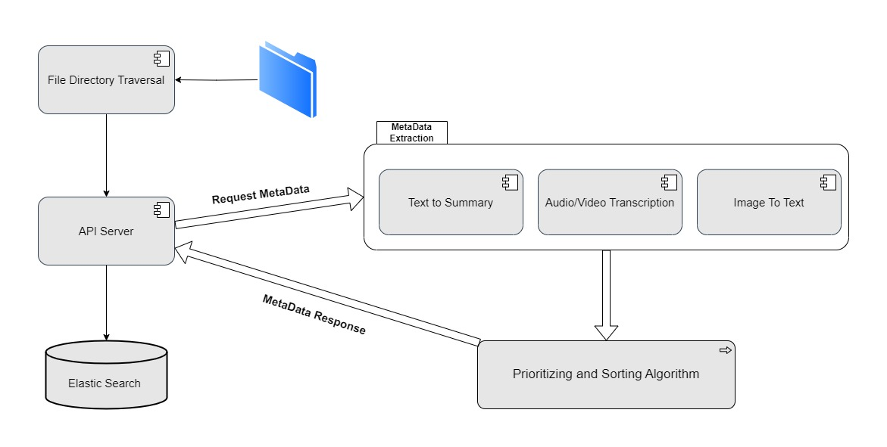
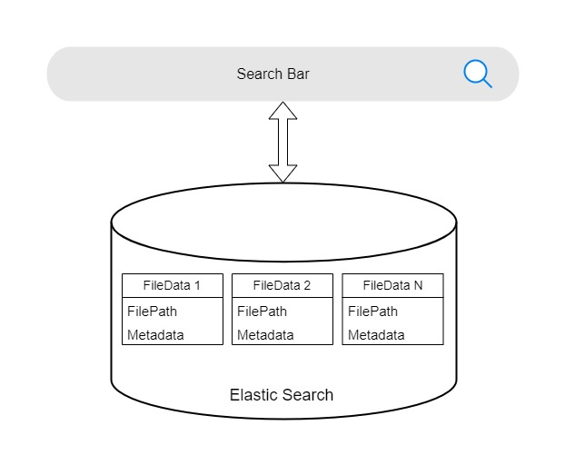
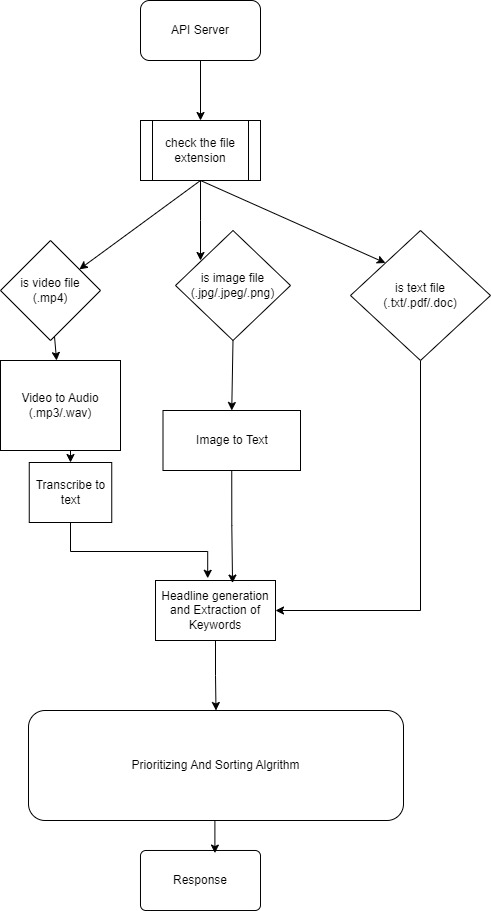

# Kickstart - Heritage Hub

## Problem Statement
[Digital Records Management for Museums and Historical Sites](https://ohack.dev/project/nIzOXqfvqwa03WPjr08a)

## Introduction

Heritage Hub System is a robust solution for organizing and making searchable a vast collection of historical files, including text documents, images, audio recordings, and more. This system is designed to meet the needs of Preservation Partners of the Fox Valley in efficiently managing their archives, preserving historical records, and enabling easy research access.

## Technologies Used

| Purpose  | Technologies Used | 
|----------|----------|
| Preprocessing Files | Java, Spring Boot | 
| MetaData API, Machine Learning Models | Python | 
| FilePath(~~Not the Actual File~~) Storage | Elastic Search |
| Front-end | React.JS, HTML5, CSS3, JavaScript |

## Architecture Diagrams
1. **Module 1 - Pre-Processing Architecture**

2. **Module 2 - File Retrieval Architecture**
   

3. **Metadata extraction Architecture**
   

## Why Our Solution is Better Than Others

- **Cost-Effective**: We don't store files anywhere, so there are no storage costs. Only file paths are stored, reducing operational expenses.

- **Faster Processing**: Leveraging concurrent programming, our system can process files efficiently, reducing user wait times.

- **Local Storage**: Everything is locally stored, eliminating the need for complex cloud infrastructure setup. It ensures the system can run offline without an internet connection.

- **Lightweight**: Our application is lightweight, ensuring it runs smoothly even on modest hardware.

- **No Security Threats**: Files are not exposed in any cloud storage, ensuring the security and privacy of historical records.

- **Legacy File Support**: Our system supports file formats from the 1980s, including **.RTF** & **.doc** files.

## Rest APIs Exposed

Our system exposes the following RESTful APIs:

- **Search**: Allows users to search for historical records using various search criteria.
- **Update File Path**: Enables the updating of file paths in the system.
- **Get Metadata**: Retrieves metadata associated with historical records.
- **Delete**: Delete the file from the folder and file data from Elastic Search

## Steps to Setup and Run the Application

1. Clone this repository to your local machine.
2. Do the environment setup as mentioned in the [Environment Setup Guide](Environment_Setup_Guide.md) file.
3. Configure the system by updating the necessary settings.
4. Start the applications (**tag_generator.py, KickstartApplication, npm run start(Frontend directory)**).
5. Access the user interface or interact with the REST APIs.

## Remaining Task Estimation

| Remaining Tasks  | Estimation Time | 
|----------|----------|
| Total Ready to ship package | 2 weeks | 
| Containerization/Dockerization of All Processes | 2 Days |
| UI Revamp | 1 day |
| Testing on the entire dataset | 4 days |
| Buffer week for any bugs | 7 days |

## Future Enhancements and Scope

We have plans to enhance the system with the following features:

- Improved user interface for a seamless user experience.
- Integration with existing systems like Past Perfect for seamless data migration.
- Enhanced file format support and more advanced metadata extraction techniques.
- User feedback mechanisms for continuous improvement.

Your feedback and contributions are welcome to help us expand the capabilities of this archive management system.

## Contributors

- [Yagnik Bandyopadhyay](https://www.linkedin.com/in/yagnik-bandyopadhyay-87b401154/)
- [Saharsh Goenka](https://www.linkedin.com/in/saharshgoenka/)
- [Tito Nadar](https://www.linkedin.com/in/tito-nadar/)
- [Divyam Pandya](https://www.linkedin.com/in/dpandya4/)
- [Sai Shashank Peddiraju](https://www.linkedin.com/in/sai-shashank-peddiraju/)

## 2023_fall Hackathon
https://hack.ohack.dev
## Team
Kickstart

## Slack Channel
`#`[Kickstart](https://opportunity-hack.slack.com/archives/C060VUW8VDW)
